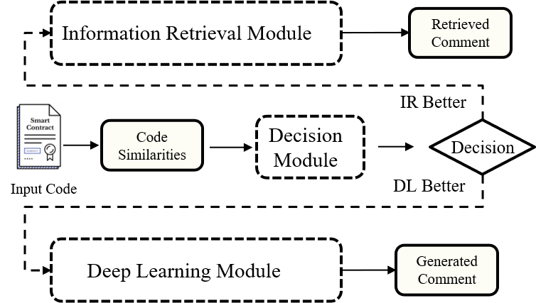
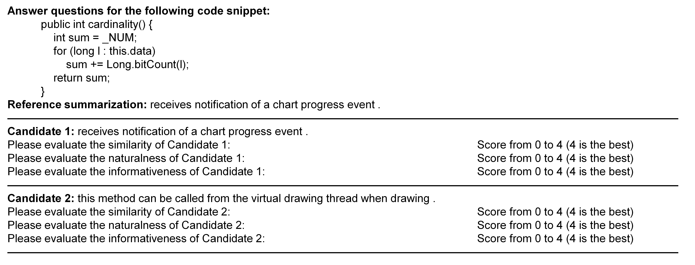

# SCS-Hybrid: Decision-based Hybrid Source Code Summarization
#### A. Framework



Previous studies mainly focused on information retrieval-based (IR) approaches and deep learning-based (DL) approaches. 

Since the quality of the comments generated by different kinds of approaches complements each other in some cases, the main objective of this study is to design a **decision-based** hybrid approach, which can automatically return the higher quality comment from the comments generated by these two kinds of approaches.

#### B. Human Study



Here we give a sample of questionnaire used in our human study.

Each participant is asked to score each comment  in terms of similarity, naturalness, and informativeness aspects  for two comments generated by SCS-Hybrid and the baseline Rencos respectively.

During the comment quality evaluation process,  the participants can search the Internet for relevant information  and unfamiliar concepts.  

To guarantee a fair comparison, the  participants do not know which comment is generated by  which approach, and the order of questionnaires is different  for different participants.  

To guarantee the comment evaluation  quality, we need each participant to review only 50 code snippets in half a day to avoid fatigue.

**Overall, the details can be found in .**

#### C. Public Pre-trained Models

https://huggingface.co/SCS/Pre-trained-model

Fine-tuned in JCSD: https://huggingface.co/SCS/Fine-tuned-JCSD

Fine-tuned in PCSD: https://huggingface.co/SCS/Fine-tuned-PCSD

SCS-IR in JCSD: /model/JCSD/kernel.pkl & bias.pkl

SCS-IR in PCSD: /model/PCSD/kernel.pkl & bias.pkl

Decision Model in JCSD: /model/JCSD/java_decide.model

Decision Model in PCSD: /model/JCSD/python_decide.model

#### D. Baselines

For the LSI, VSM, NNGen, and BM25, we implement them by code in https://github.com/NTDXYG/IR-based-Code-Comment-Generation

For the TL-CodeSum, we implement it by code in https://github.com/xing-hu/TL-CodeSum

For the Rencos, we implement it by code in https://github.com/NTDXYG/Rencos_modify

For the Transformer, we implement it by code in https://github.com/wasiahmad/NeuralCodeSum

For the CodeBERT, we implement it by code in https://github.com/microsoft/CodeBERT/tree/master/CodeBERT/code2nl

For the CodeNN and GRNMT, we re-implement them with the description of the original paper.

#### E. How to use

```python
# Step 1. First propose the source code and get the sbt sequence
code_seq, sbt = sbt_utils_java.transformer(code)

# Step 2. Then use SCS-IR compute the features
result = get_sim_info(java_scsir, code_seq, sbt)

# Step 3. Make the decision which method to use
if (java_model_decide.predict([[result['code_score'], result['ast_score'], result['inner_score']]])[0] == 0):
	return result['sim_nl']
else:
	dl_nl = get_dl_comment(java_scsdl, code_seq, sbt)
	return dl_nl
```